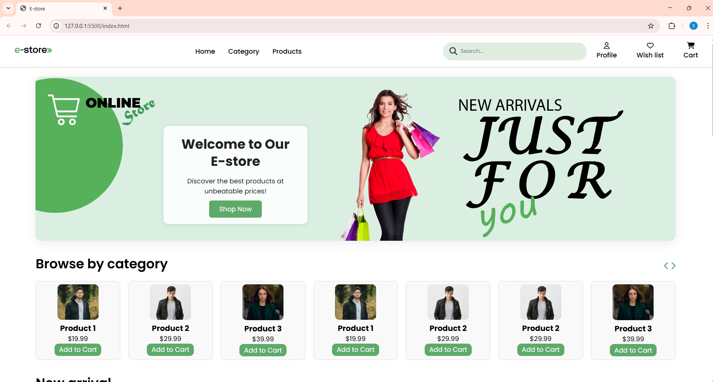
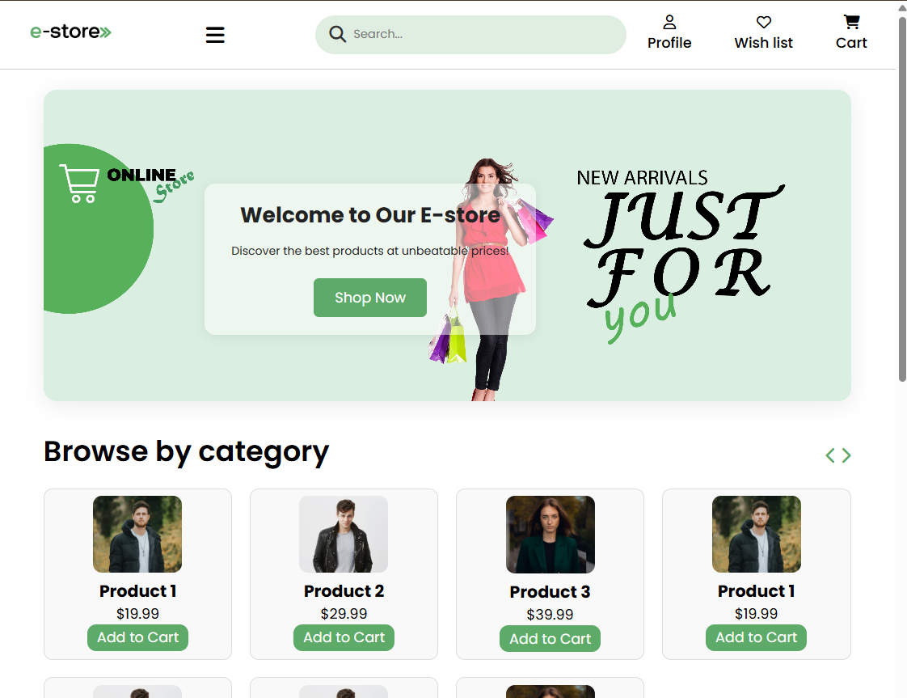

# 🛍️ E-commerce Website

A fully responsive e-commerce website built with **HTML**, **CSS**, and **JavaScript**. This is a frontend-only project that includes a responsive header, product sections, interactive hamburger menu, and optimized images for better performance.

## 🚀 Live Preview

🔗 [View Live Site](https://kkghosh01.github.io/E-commerce-website/)

---

## ✨ Features

- ✅ Fully Responsive Design
- ✅ Hamburger Menu for Small Screens
- ✅ Product Grid Layout
- ✅ Optimized Images for Fast Loading
- ✅ Reusable Components
- ✅ Modern, Clean UI

---

## 📁 Folder Structure

E-commerce-website/
│
├── assets/
│ ├── images/ # Optimized PNG images
│ └── icons/ # SVG/FontAwesome icons
│
├── style/
│ └── style.css # All custom styles
│
├── script/
│ ├── index.js # Menu toggle and user interactions
│ └── scrollObserver.js # Scroll-based animations/interactions
│
├── index.html # Main landing page
├── LICENSE # Project license
└── README.md # Project documentation

---

## 🧰 Tech Stack

- HTML5
- CSS3 (Flexbox, Grid, Media Queries)
- JavaScript (Vanilla)
- Git & GitHub

---

## 📸 Screenshots

| Desktop View | Mobile View | Tablet View |
|--------------|-------------|-------------|
|  |  |  |

> Replace the above paths with your actual screenshots if available.

---

## 🛠️ How to Use

```bash
# Clone the repo
git clone https://github.com/kkghosh01/E-commerce-website

# Go to project folder
cd E-commerce-website

# Open the project in browser
open index.html

    
